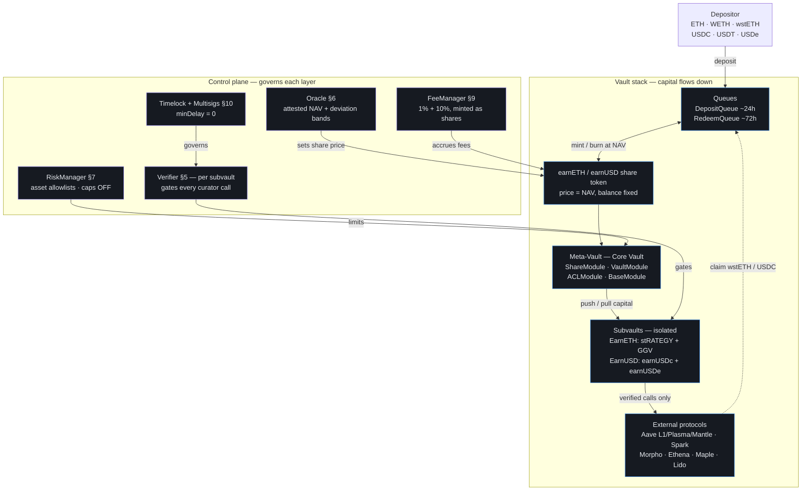
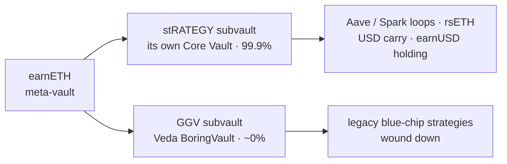
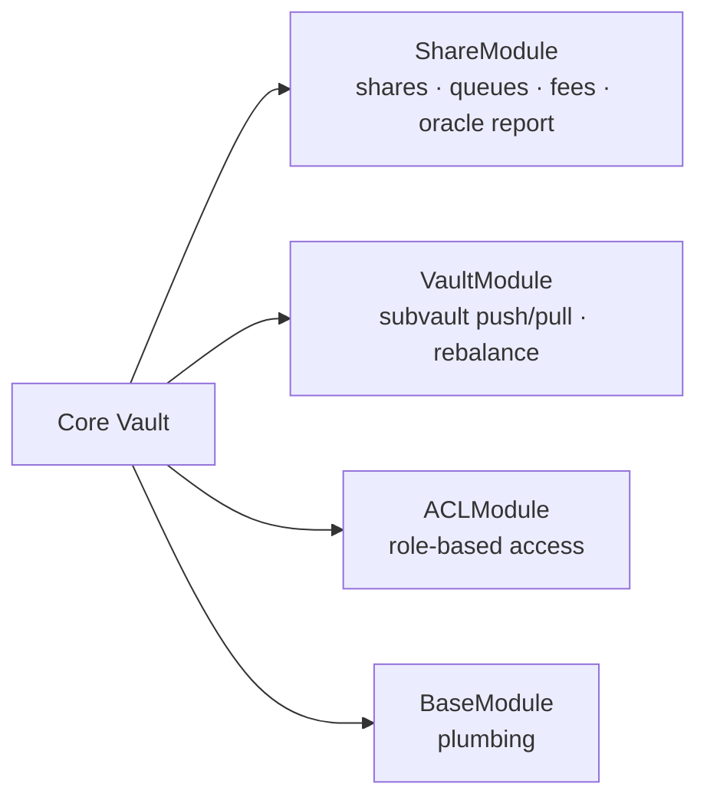
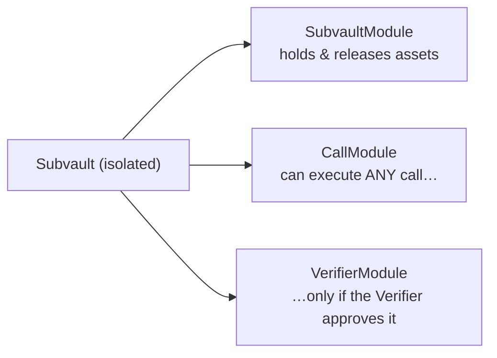
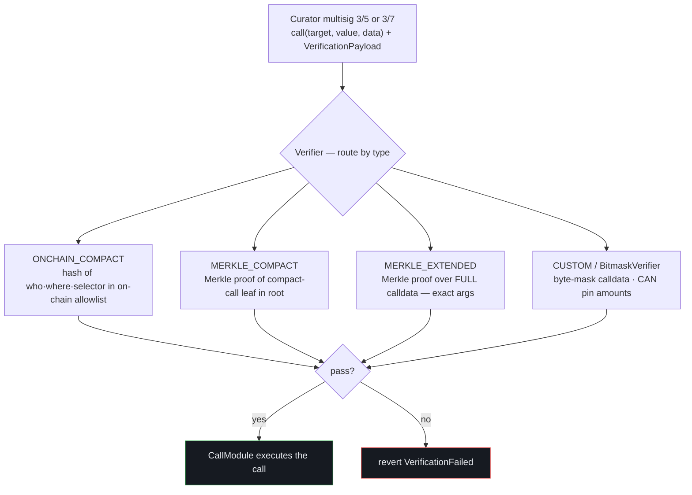
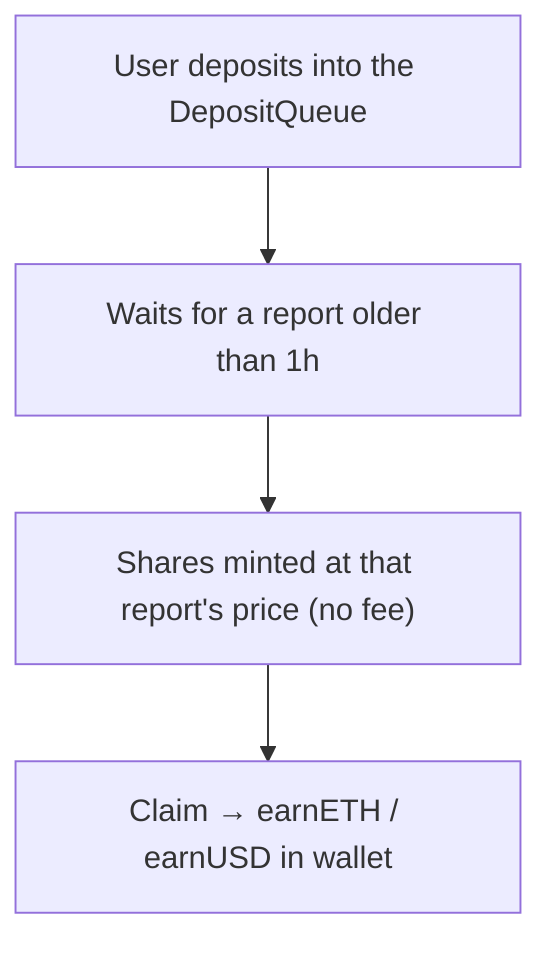
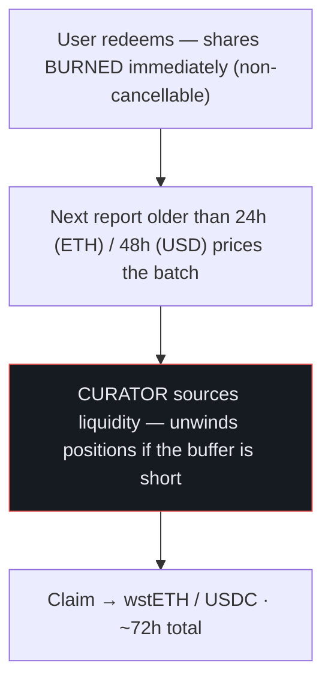
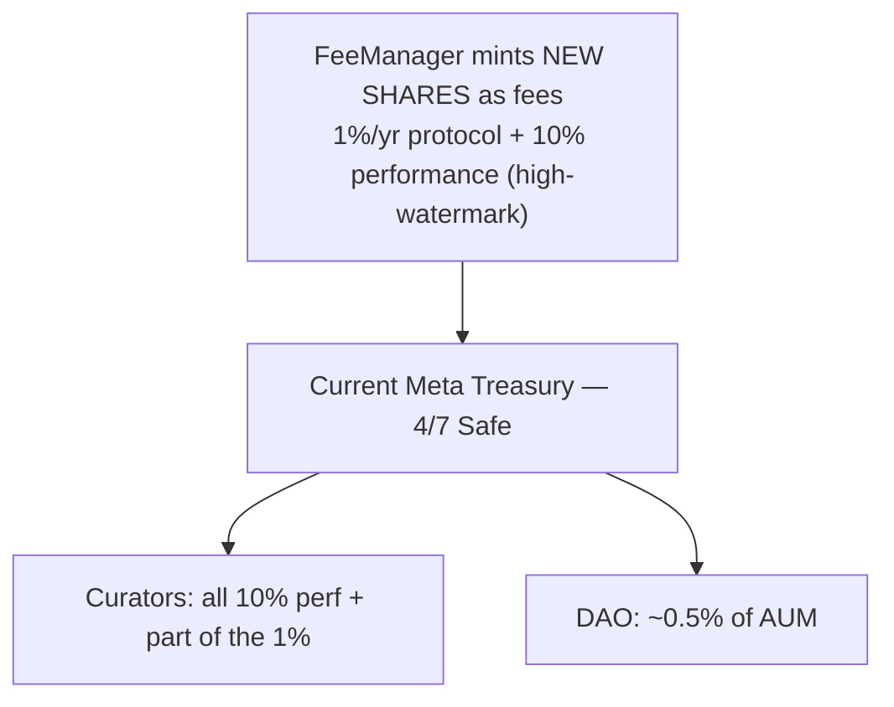
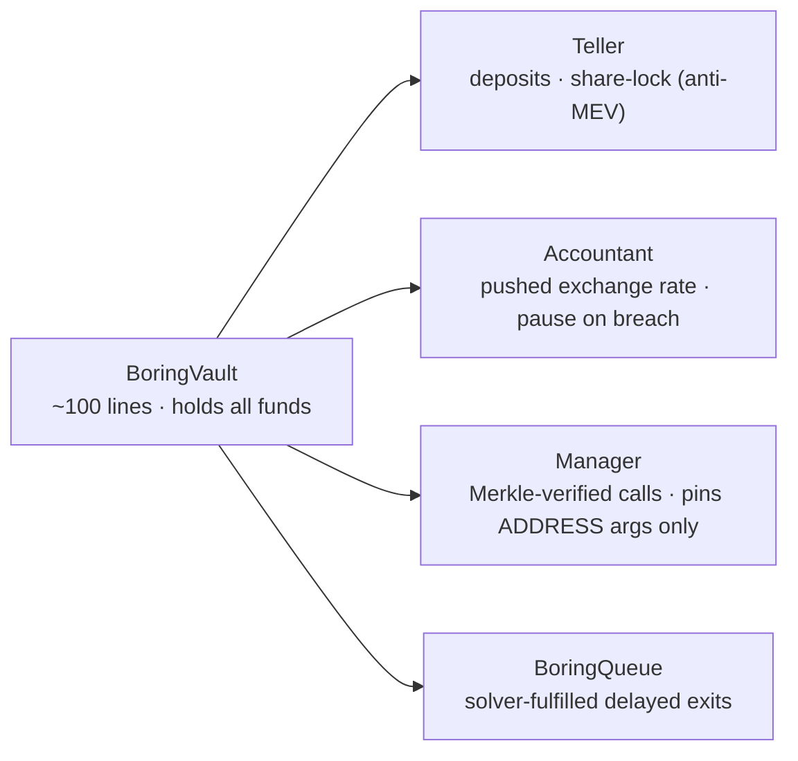

# Lido Earn — Architecture Deep Dive
### Every contract, what it does, who controls it, and how value + risk flow through the system

*Compiled 2026-07-18. Stack: Mellow Flexible Vaults ("Core Vaults") + MetaVaults, powering EarnETH & EarnUSD. Parameters read on-chain (block 25,555,811); mechanics from docs.mellow.finance + github.com/mellow-finance/flexible-vaults + lidofinance deployment docs. Legacy GGV runs on Veda BoringVault (covered in §11). This is the "explain it to me like I'll be quizzed" version.*

**Contents:** §1 the 30-second model · §2 the layered map · §3 the Vault (4 modules) · §4 Subvaults · §5 the Verifier (how curator power is gated) · §6 the Oracle (NAV & the trust core) · §7 RiskManager · §8 Queues (deposit/redeem) · §9 FeeManager · §10 roles & multisigs · §11 Veda/GGV legacy · §12 trust boundaries · §13 the interview cheat-lines

---

## 1. The 30-second model

A depositor gives ETH (or USD). They get a **share token** (earnETH/earnUSD) whose *price* rises as strategies earn — the balance never changes, the price does. Their capital flows down into **subvaults**, which deploy it into external protocols (Aave, Spark, Ethena, Maple…). A **curator** decides the strategies but can only make calls a **Verifier** has pre-approved. An **Oracle** periodically pushes an attested NAV that sets the share price. To leave, you burn shares into a **queue** and wait ~72h while the curator sources the liquidity.

Three sentences that capture the whole risk model:
1. **The share price is an attested number, not a live computation** — an off-chain NAV pushed on-chain with deviation guards (§6).
2. **The curator's power is bounded by an allowlist, not by caps** — it can only call whitelisted actions, but there's no on-chain limit on *how much* (§5, §7).
3. **Redemption liveness is a curator obligation, not a contract guarantee** — you get your money when the curator can unwind the positions (§8).

---

## 2. The layered map

Capital flows **down** the left spine (depositor → queues → shares → meta-vault → subvaults → protocols); the **control plane** on the right governs each layer. Value comes back up as NAV; withdrawals exit through the queues.



**Nesting** (this trips people up): EarnETH is a *meta-vault* whose subvaults are *themselves* Mellow Core Vaults. stRATEGY is a full vault with its own subvaults and its own verifier; the meta-vault just allocates between stRATEGY and GGV — two layers of the same machinery stacked:



> If your viewer doesn't render Mermaid, open this file on GitHub (github.com/kubesqrt/lido-earn-benchmark if committed) or in VS Code / Obsidian — the blocks above draw as real diagrams there. The visual [architecture map](https://kubesqrt.github.io/lido-earn-benchmark/architecture.html) is the always-rendered version.

---

## 3. The Vault = 4 modules

The Core Vault contract isn't monolithic — it composes four modules, each owning one concern. Think of it as the chassis; the modules are the subsystems.



| Module | What it does | Why it matters for a curator |
|---|---|---|
| **ShareModule** | Share accounting, deposit/redeem queues, receives the oracle report (`handleReport()`), triggers fee accrual | This is where the NAV becomes a price and where fees are minted. The queue-pause switch lives here. |
| **VaultModule** | Manages the subvault set; pushes capital down and pulls it back up | This is how the *meta-vault* rebalances between stRATEGY and GGV — the "rotate a whole strategy" capability. |
| **ACLModule** | Role-based permissions (MellowACL = OpenZeppelin `AccessControlEnumerable` + active-role tracking) | Every privileged action checks a role here. The role holders (§10) are the real power map. |
| **BaseModule** | Auxiliary interfaces and storage helpers | Plumbing — not a risk surface. |

---

## 4. Subvaults — where the money actually sits

A subvault is an *isolated* child that holds assets and executes strategy calls. It has **no external deposit/redeem interface** — only the parent meta-vault can push/pull. Its power to touch external protocols runs through three modules:



**The key idea:** `CallModule` can call *anything* — but only after `VerifierModule` says the call is on the allowlist. That's the entire security model for curator discretion: arbitrary power, whitelisted execution.

| Vault | Subvaults | What each holds |
|---|---|---|
| EarnETH | **stRATEGY** (99.9%) + **GGV** (~0%, legacy Veda) | the levered wstETH/rsETH loops, the USD carry, the earnUSD holding |
| EarnUSD | **earnUSDc** (conservative) + **earnUSDe** (experimental) | Spark/Maple/PYUSD vs the levered Plasma/Mantle/Ethena book |

---

## 5. The Verifier — how curator power is gated (the heart of the system)

Every curator rebalance call is checked against a per-subvault **Verifier** before `CallModule` executes it. The curator submits the call *plus a proof* that the call is permitted. Four verification types, increasing in strictness:



**Verification types explained:**

| Type | What it pins | Example use |
|---|---|---|
| `ONCHAIN_COMPACT` | (caller, target, selector) hash must be in an admin-set on-chain allowlist | "curator may call `supply()` on Aave Pool" |
| `MERKLE_COMPACT` | Merkle proof that the (who, where, selector) leaf is in the current root | same, but cheaper to update in bulk |
| `MERKLE_EXTENDED` | Merkle proof over the **exact full calldata** | "may call `supply(USDC, exactly this amount, this onBehalfOf)`" |
| `CUSTOM_VERIFIER` (BitmaskVerifier) | byte-level mask of calldata — `0xff` = byte must match, `0x00` = wildcard | "approve to *this* pool, *any* amount" — and it **can constrain amounts**, unlike Veda's Merkle leaves |

**The roles that govern it** (who can change what's allowed):
- `SET_MERKLE_ROOT_ROLE` — swap the whole allowlist (the supreme power)
- `ALLOW_CALL_ROLE` / `DISALLOW_CALL_ROLE` — add/remove single entries
- `CALLER_ROLE` — who may *initiate* a call (the curator)

**Interview line:** *"Onboarding a protocol to the vault = adding a verifier entry. The curator can't touch anything outside the allowlist — but the allowlist-setter outranks the curator, and there's no on-chain cap on size once a market is allowed. So the verifier is a qualification gate, not a sizing framework."*

---

## 6. The Oracle — NAV & the trust core

The share price is **not** computed on-chain from live positions. An off-chain process values the book, and an updater **pushes** that NAV on-chain. On-chain safety checks decide whether to accept it. This is the single most important thing to understand about the vault's trust model.

```mermaid
flowchart TB
  OFF["OFF-CHAIN: value the book → NAV → share price"]
  OFF -->|"submitReports() · updater 3/8 Safe 0x93a7"| G{"SecurityParams gate"}
  G -->|"asset unsupported / timeout &lt;20h not elapsed"| RV1["revert"]
  G --> DEV{"price deviation vs last report"}
  DEV -->|"within band ≤0.1%"| ACC["ACCEPTED<br/>takes effect immediately"]
  DEV -->|"suspicious 0.1–0.5%"| HELD["HELD — needs a SEPARATE key<br/>ACCEPT_REPORT_ROLE 5/8 Safe 0x0Dd7"]
  DEV -->|"&gt; 0.5% max"| RV2["REJECTED — revert InvalidPrice"]
  HELD -->|"acceptReport()"| ACC
  ACC --> HR["handleReport() → queues settle at new price,<br/>protocol fee accrues, perf fee vs high-watermark"]
  classDef ok fill:#161a21,stroke:#2fb54d,color:#e8ebf0;
  classDef sus fill:#161a21,stroke:#fab219,color:#e8ebf0;
  classDef bad fill:#161a21,stroke:#e05252,color:#e8ebf0;
  class ACC,HR ok;
  class HELD sus;
  class RV1,RV2 bad;
| Control | Setting | Status |
|---|---|---|
| global vault limit | 2^254 (~ infinity) | **OFF** — placeholder |
| per-subvault limits | 2^254 (~ infinity) | **OFF** — placeholder |
| per-subvault allowed-asset list | set | active |
| pending-balance tracking | active | active |
 ┌──────────────────────── RiskManager ────────────────────────┐
 │                                                              │
 │  global vault limit ............ 2^254  (≈ ∞ — OFF)          │
 │  per-subvault limits ........... 2^254  (≈ ∞ — OFF)          │
 │  per-subvault allowed-asset list  SET   (✓ ACTIVE)           │
 │  pending-balance tracking ...... active (queued deposits)    │
 │                                                              │
 │  conversion: shares = value × priceD18 / 1e18                │
 │  (limits are share-denominated, "approximate" — assumes      │
 │   correlated assets; trusted correction via modify* roles)   │
 └──────────────────────────────────────────────────────────────┘
```

So of the four things it *could* enforce, only the **allowed-asset list** is active (which tokens a subvault may hold). There is **no on-chain cap on position size, leverage, or concentration** — which is why the book can run a 42% single position and 12× leverage (nothing stops it). Real exposure control today = the verifier allowlist (binary) + curator discretion.

**This is a load-bearing interview fact:** the allocation-parameter layer this role would build (encoded caps, per-cluster limits sized to exit liquidity) *does not exist on-chain yet.*

---

## 8. Queues — deposit and redemption flow

### Deposit (async)


Why the delay: deposits price at the **next attested NAV**, killing same-block NAV-sniping. (An instant "signature queue" path exists, pricing against an EIP-712-signed quote from a Consensus signer set.) Both vaults' queues are **at capacity** (EarnETH 13/13, EarnUSD 6/6).

### Redemption (async — the 72h explained)



**Why ~72h** = redeemInterval (24–48h) + report cadence (≤20h) + the curator's unwind time. **The redemption promise is only as good as the curator's ability to exit positions** — which is why "stress-exit quality" (the Kelp review's language) and the idle buffer (EarnETH 7.3% vs EarnUSD 0.1%) are not niceties. If the curator can't unwind (e.g., a frozen rsETH market), the queue simply doesn't clear.

---

## 9. FeeManager — fees are minted as shares

Fees never leave as a transfer. New shares are minted to the fee recipient, diluting everyone slightly — so your *balance* is untouched and your *price per share* grows a touch slower.



**Note the governance quirk:** FeeManager is a plain `Ownable` owned by the 5/8 admin Safe and is **not behind the timelock** — fees can change in one transaction. And the performance fee (compensation for *discretionary skill*) flows entirely to the external curator, which is the crux of the operating-model question.

---

## 10. Roles & multisigs — the real power map

Everything privileged routes through these roles. Two corrections from the on-chain sweep are baked in: **timelocks have `minDelay = 0`** (no waiting period), and **pausers are timelock *executors*, not unilateral keys.**

_(Grouped by function; full detail in the table below.)_

| Role | Threshold | Powers | Guardrail |
|---|---|---|---|
| Proxy Admin | 5/8 | upgrade implementations — the nuclear key | timelock (but delay = 0) |
| Lazy Vault Admin | 5/8 | non-urgent config: queues, limits, role grants, **verifier entries** | timelock (delay = 0) |
| Active Vault Admin | 3/8 | time-sensitive ops | narrower scope |
| Curator (meta-vaults) | 3/5 | rebalance calls; fulfil redemption batches | only verifier-allowlisted calls |
| Curator (USD subvaults) | 3/7 | same, for earnUSDc/earnUSDe | same |
| Oracle updater | 3/8 | `submitReports` (share price) | deviation bands + 20h timeout |
| Oracle accepter | 5/8 | accept suspicious-band reports | distinct key from updater |
| Pausers (Lido + Mellow) | Safe → timelock executor | pause queues / operations | minDelay 0 = immediate; not single-signer |
| Current Meta Treasury | 4/7 | fee collection & distribution | split ratios private |
| DAO first-loss | policy | absorbs losses first via DAO share burn | **triggers at 1% vault MTM loss** |

**The power hierarchy, plainly:** allowlist-setters (Lazy Admin, `SET_MERKLE_ROOT_ROLE`) > curators. The curator can only act inside the allowlist; whoever sets the allowlist can change what "inside" means — and with minDelay = 0, next-block. So the multisig thresholds *are* the defense; there is no reaction window.

---

## 11. The GGV legacy — Veda BoringVault (one section so you're fluent)

GGV (now ~0% of EarnETH) runs on a *different* stack — Veda's BoringVault — worth knowing because the interviewer helped build it and the contrast is instructive.



**Mellow vs Veda — the one distinction to know:** both gate curator calls with Merkle allowlists, but **Veda's leaves pin only address arguments — scalar amounts are NOT natively constrained** (enforced operationally). **Mellow's BitmaskVerifier *can* pin any calldata byte, including amounts.** So Mellow's stack is capable of tighter on-chain constraints — though, as §7 shows, the quantitative caps aren't actually turned on today.

---

## 12. Trust boundaries — where the risk actually lives

**The depositor is trusting, in order:**
1. **Oracle updater + accepter** — won't push a false NAV (bounded by the +/-0.5% band; the tail is updater + accepter colluding).
2. **Allowlist-setter** — won't whitelist a malicious call (minDelay = 0 means no reaction window — the multisig thresholds are the defense).
3. **Curator (sizing)** — will size sanely; nothing on-chain forces it (section 7 caps are off).
4. **Curator (liveness)** — can actually unwind to honor redemptions (see the frozen rsETH market).
5. **External protocols** — Aave / Ethena / Maple / Plasma solvency (the real position risk).
6. **Bridges** — USDT0 / cross-chain integrity (the 2026 tail; Kelp proof).

**Attack-surface summary (with the on-chain corrections):**
1. Allowlist-setters > curators, and with **timelock delay = 0**, config changes land next-block — the thresholds are the only defense, there is no depositor exit window.
2. **RiskManager caps are off (2^254)** — real exposure control is the verifier allowlist (binary) + discretion.
3. **FeeManager is plain Ownable, not timelocked** — fees change in one tx.
4. Oracle tail bounded by ±0.5%/report and the 20h timeout; the real risk is updater + accepter collusion.
5. Redemption liveness is a curator obligation — a frozen underlying market (rsETH) means the queue can't clear regardless of contract correctness.

---

## 13. Interview cheat-lines (say these and you sound like you built it)

- *"It's a meta-vault over subvaults that are themselves Core Vaults — two layers of the same machinery. The meta-vault rotates between stRATEGY and GGV; each subvault has its own verifier and its own limits."*
- *"Curator power is arbitrary-call, whitelisted-execution: CallModule can call anything, the Verifier only lets pre-approved calls through. Onboarding a protocol = adding a verifier entry."*
- *"The share price is an attested NAV pushed by a 3/8 updater, with a ±0.5% reject band and a 0.1% suspicious band that needs a separate 5/8 accepter — two-key control on big moves. It's an oracle trust model, not an on-chain computation."*
- *"The RiskManager exists but its caps are set to infinity — so there's no on-chain limit on size, leverage or concentration. That's exactly the layer this role would build."*
- *"Timelocks read minDelay = 0 on-chain — the propose/execute split adds no delay, so the multisig thresholds are the whole defense. I'd want a real delay on verifier-root changes."*
- *"72h redemptions = redeemInterval + report cadence + the curator's unwind time. Liveness depends on the curator being able to exit — which is why exit-quality caps and the idle buffer matter, and why a frozen rsETH market is a redemption problem, not just a P&L one."*
- *"Fees are minted as shares; the 10% performance fee goes entirely to the external curator, and the FeeManager isn't even timelocked — which is the crux of whether curation should be internalized."*

*Companion pages: the live [architecture map](https://kubesqrt.github.io/lido-earn-benchmark/architecture.html) (visual) and [position atlas](https://kubesqrt.github.io/lido-earn-benchmark/positions.html). This doc is the deep reference; those are the at-a-glance versions.*
